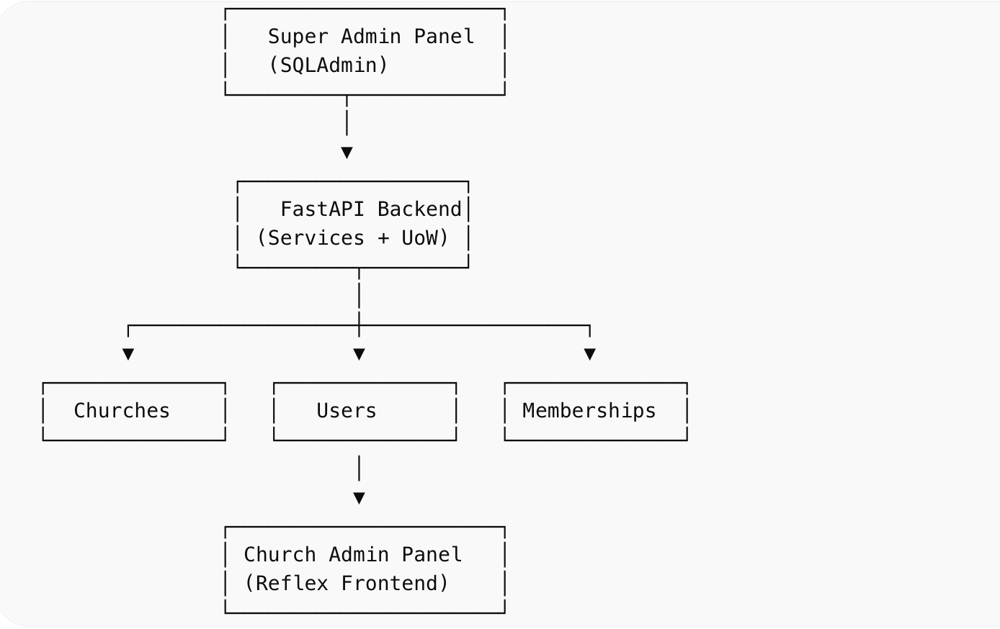

This section handls the backend of Ekklesia.

**Content**

- Admin System Overview
- API documentation section
- Telegram Integration Design
- Database schema diagram

# 🛠️ Admin System Overview

Here, we implement a dual-admin architecture to separate responsibilities between platform-level control and church-level operations.

This ensures:
- Clear separation of concerns
- Better security and access control
- Scalable multi-tenant design

## 🧠 Architecture Summary

## 👑 Admin Roles
### Super Admin
Super Admins manage the entire platform.

Capabilities
- Create and manage churches
- Assign main members (church admins)
- Activate / deactivate churches
- View all users and memberships
- Manage system-wide configurations

Interface
- Built using SQLAdmin
- Accessible via `/admin`

### ⛪ Church Admin (Main Members)

Church Admins manage their specific church.

Capabilities
- Invite members
- Assign roles within their church
- Send announcements via Telegram
- Manage church-level activities

Interface
- Built using Reflex
- Custom UI tailored to church operations

## 🧩 Core Design Decisions

### 🔹 Separation of Admin Interfaces
We intentionally use two different admin systems:

| Layer        | Tool     | Purpose                 |
| ------------ | -------- | ----------------------- |
| Super Admin  | SQLAdmin | Internal system control |
| Church Admin | Reflex   | User-facing dashboard   |

#### Why?
- SQLAdmin is fast for CRUD operations
- Reflex allows rich, customized UI
- Prevents exposing sensitive system controls to regular admins

### 🔹 Multi-Tenant Architecture
FBCBot is designed as a multi-tenant system, where:
- Each church is isolated logically
- Users belong to churches via memberships
- Data access is scoped per church

### 🔹 Membership-Based Role System

Instead of assigning roles directly to users:
> Roles are assigned through a Membership model

Benefits
- A user can belong to multiple churches
- A user can have different roles in different churches
- Cleaner and more scalable design

#### Optional `church_id`
- Super Admins are not tied to any church
- Regular members must belong to a church
- Enforced at the service layer, not DB level

### 🔐 Authentication Strategy
Super Admin Authentication
- Email + password login
- Verified using Argon2 hashing
- Session-based authentication (via SQLAdmin)

Password Hashing
- We use `argon2-cffi`

Why Argon2?
- No password length limitations
- Resistant to GPU attacks
- Recommended by modern security standards

# 🌐 API documentation

The FBCBot backend exposes a set of RESTful APIs built with FastAPI, designed to support:

- Church management
- User authentication
- Membership and role assignment
- Telegram bot interactions

## 🔗 Base URL
`/api/v1`

## API docs
`/api/v1/docs`

# 🤖 Telegram Integration Design
Instead of one bot per church:
> We use a single global Telegram bot

How isolation is achieved:
- Each user has a telegram_id
- Each user is linked to a church via Membership
- All interactions are scoped using:
    - telegram_id
    - church_id

Benefits
- Easier to manage
- Scalable
- Avoids token management complexity

# Database schema diagram
Database schema can be found [here](../docs/databse_design.md)