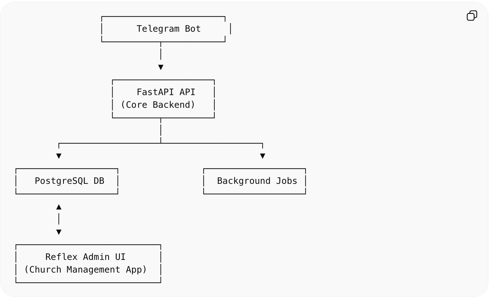

# Architectural Design
✅ Modular Monolith

## Tech Stack
- 🧠 FastAPI = backend (API + Telegram + business logic)
- 🧑‍💼 Reflex = admin dashboard
- 🗄️ PostgreSQL = shared database

## 🔹 🏗️ High-Level Architecture



## Project structure (Monolith)

```bash
ekklesia/
│
├── backend/                    # FastAPI Backend
│   ├── app/
│   │   ├── core/              # Config, security
│   │   │   ├── config.py
│   │   │   ├── security.py
│   │   │
│   │   ├── db/                # Database setup
│   │   │   ├── base.py
│   │   │   ├── session.py
│   │   │
│   │   ├── models/            # SQLAlchemy models
│   │   │   ├── user.py
│   │   │   ├── church.py
│   │   │   ├── sermon.py
│   │   │   ├── prayer.py
│   │   │
│   │   ├── schemas/           # Pydantic schemas
│   │   │   ├── user.py
│   │   │   ├── sermon.py
│   │   │
│   │   ├── crud/              # DB queries
│   │   │   ├── user.py
│   │   │   ├── sermon.py
│   │   │
│   │   ├── services/          # Business logic
│   │   │   ├── user_service.py
│   │   │   ├── sermon_service.py
│   │   │
│   │   ├── api/               # REST endpoints
│   │   │   ├── deps.py
│   │   │   ├── user.py
│   │   │   ├── sermon.py
│   │   │
│   │   ├── bot/               # Telegram logic
│   │   │   ├── handlers/
│   │   │   │   ├── start.py
│   │   │   │   ├── prayer.py
│   │   │   │   ├── sermon.py
│   │   │   │
│   │   │   ├── router.py
│   │   │   ├── webhook.py
│   │   │
│   │   └── main.py            # FastAPI entry
│   │
│   ├── alembic/
│   ├── alembic.ini
│   ├── requirements.txt
│   └── .env
│
├── admin/                     # Reflex App
│   ├── app/
│   │   ├── pages/             # UI pages
│   │   │   ├── dashboard.py
│   │   │   ├── sermons.py
│   │   │   ├── requests.py
│   │   │
│   │   ├── components/        # Reusable UI
│   │   ├── services/          # API calls to backend
│   │   │   ├── api_client.py
│   │   │
│   │   ├── state/             # Reflex state
│   │   │   ├── sermon_state.py
│   │   │
│   │   └── main.py
│   │
│   ├── rxconfig.py
│   └── .env
│
├── shared/                    # Shared logic (optional)
│   ├── constants.py
│   ├── enums.py
│
└── README.md
```

## 🔹 🧠 Key Design Principles
### 1. 🔌 Separation of Concerns

| Layer    | Responsibility   |
| -------- | ---------------- |
| FastAPI  | Logic, DB, APIs  |
| Reflex   | UI only          |
| Telegram | User interaction |

### 2. 🔄 Reflex Talks to Backend via API
Inside reflex
```py
# admin/app/services/api_client.py

import httpx

BASE_URL = "http://localhost:8000/api/v1"

def get_sermons():
    return httpx.get(f"{BASE_URL}/sermons").json()
```

### 3. 🤖 Telegram Talks to FastAPI
Webhook:
```py
# backend/app/bot/webhook.py

@router.post("/webhook")
async def telegram_webhook(update: dict):
    # process update
    handle_update(update)
```

## 🔹 🔌 How Everything Connects
### Flow 1: Telegram User
`User → Telegram → FastAPI → DB`

### Flow 2: Admin
`Admin UI (Reflex) → FastAPI → DB`

### Flow 3: Broadcast
`Admin → FastAPI → Telegram API → Users`

## 🔹 📁 Git Repository Strategy
👉 Monorepo, but deployed separately
```sh
ekklesia/
├── backend/
├── admin/
├── shared/ (optional)
```

## 🔹 🧱 Deployment Strategy
- Backend:
    - Deploy FastAPI (Render, Railway, VPS)
- Admin:
    - Deploy Reflex separately (Reflex hosting, Vercel)
- DB:
    - Shared PostgreSQL (Supabase / Neon)


Initialize the monorepo structure properly
Set up uv + workspace workflow
Or scaffold backend + reflex apps together