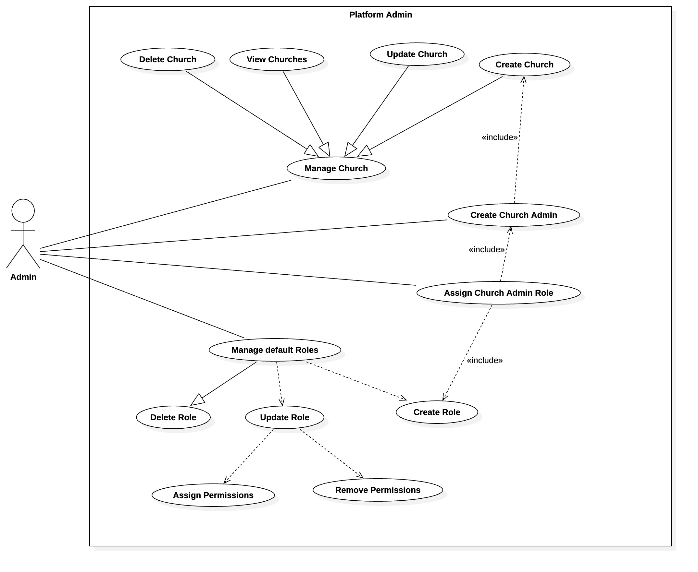
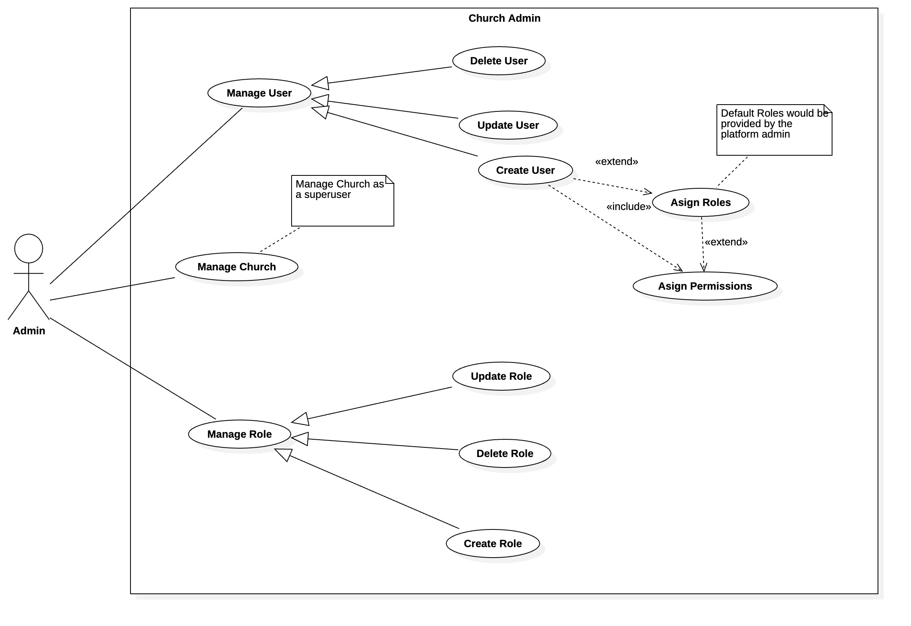
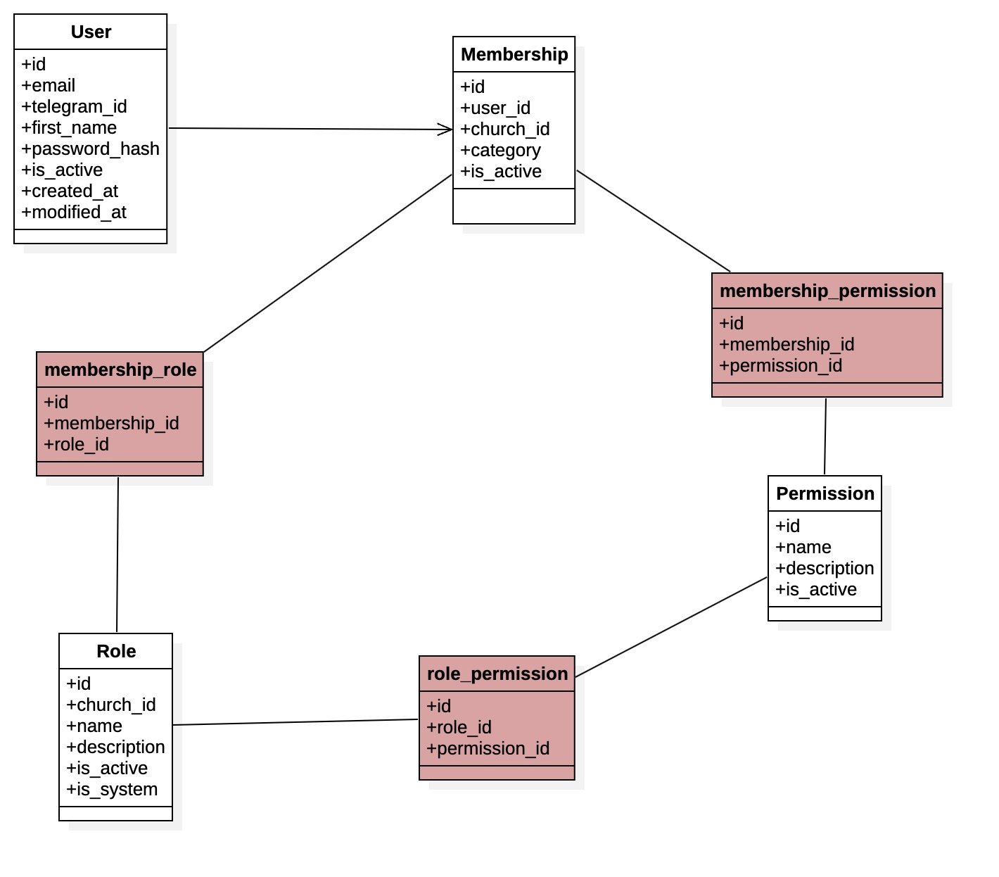

# Authorization and Authentication 
## Structure
- User
- Role
- Permission

## Superuser
The role `Church Admin` will be created to have superuser priviledges. This role can be assigned to any person responsible for administering the church account.

## How Church and Users are created
To create a church, the platform admin creates the church, and a church admin and hand this over to the church. Then the church admin can create the different users, then attached to them roles and permissions.

```
Platform Admin (you)
        │
        ▼
Create Church
        │
        ▼
Create Church Admin
        │
        ▼
Church Admin creates:
    - Pastors
    - Deacons
    - Prayer Team
    - Counselors
    - Teachers
    - Announcement Managers
```
## Roles
Roles will have permissions, and then assigned to users. We shall have predefined church roles like;
- Senior Pastor
- Youth Pastor
- Postor
- Deacon
- Vice Deacon
- Prayer Team
- Counselor
- Teacher
- Announcement Manager

## Permissions
Permissions would drive access, and not role.

Most feature in the Ekklesia will have permissions in the space of `view`, `create`, `update`, `delete`
For example:
- `announcement.view`
- `announcement.create`
- `announcement.update`
- `announcement.delete`

Other permissions spaces are:
- User
    - `role.assign`
- Prayer Request
    -  `prayer.respond`

Permissions can be assigned to roles or to users directly.


| Role                 |  Create  |   Edit   |  Delete  |  View       |
| -------------------- | :------: | :------: | :------: | :------:    |
| Church Admin         |     ✅    |     ✅    |     ✅    |     ✅    |
| Senior Pastor        |     ✅    |     ✅    |     ✅    |     ✅    |
| Youth Pastor         |     ✅    |     ✅    |     ✅    |     ✅    |
| Pastor               |     ✅    |     ✅    |     ✅    |     ✅    |
| Church secretary     |     ✅    |     ✅    |     ✅    |     ✅    |
| Deacon               | Optional | Optional  | Optional  |     ✅    |
| Prayer Team          |     ❌    |     ❌    |     ❌    |     ✅    |
| Counselor            |     ❌    |     ❌    |     ❌    |     ✅    |
| Teacher              | Optional  | Optional |     ❌    |     ✅    |

- Hide the `Create`, `Update`, `Delete` buttons if the user lacks the neccessary permissions.

### Allow customization
We allow the Church Admin to customize permissions when needed.

Every church is different.

For example:

- Church A says:
    - `"Only pastors can publish announcements."`
- Church B says:
    - `"Our secretary publishes announcements."`
- Church C says:
    - `"The media team does everything."`

```
Role: Announcement Manager

☑ Create announcements
☑ Edit announcements
☑ Delete announcements
☑ Publish announcements
☐ Manage users
☐ Manage church settings
```

### User Structure

```
Create User

Name: __________________

Email: _________________

Role:
▼ Pastor

Permissions
☑ Use role defaults
```

### Support multiple roles
Real churches often have people serving in more than one capacity.
```
John Doe

Roles

☑ Pastor
☑ Teacher
☑ Announcement Manager
```

## Authorization Structure

```
Church
    │
    ├── Users
    ├── Roles
    └── Permissions
```

Where:
- A `User` can have one or more roles.
- A `Role` contains a set of permissions.
- A `Permission` represents one specific capability (e.g., `announcement.create`).

## Use Case Diagram

### 1. Platform Administration Use Case

```
                    +--------------------------------------+
                    |            EKKLESIA                  |
                    +--------------------------------------+

                     +-----------------------+
                     |   Platform Admin      |
                     +-----------------------+
                                |
        -------------------------------------------------------------------------
        |              |               |               |            |           |
        |              |               |               |            |           |
  (Create Church) (Update Church) (Deactivate Church) (View Churches)     (Manage default roles)
        |
        |
(Create Church Admin)
        |
        |
(Assign Church Admin Role)
```



### 2. Church Administration Use Case
```
                              +--------------------------------------+
                              |             EKKLESIA                 |
                              +--------------------------------------+

                                 +----------------------+
                                 |     Church Admin     |
                                 +----------------------+
                                      /      |      \
                                     /       |       \
                                    /        |        \
                                   /         |         \
                          (Manage Users) (Manage Roles) (Manage Church)

                                  |
             --------------------------------------------------
             |                     |                        |
             |                     |                        |
       (Create User)        (Update User)          (Deactivate User)

                                  |
                                  |
                           (Assign Roles)

                                  |
                                  |
                          (Assign Permissions)

                                  |
             -----------------------------------------------
             |                     |                      |
             |                     |                      |
      (Create Role)         (Update Role)         (Delete Role)
                                  |
                                  |
                      (Assign Permissions to Role)
                                  |
                                  |
                                  |
                                  |
                    -----------------------------
                    |            |              |
                announcement.*  user.*      prayer.*
                member.*        event.*     church.*
            
```



## Activity Diagram
```
Start
   │
   ▼
Login
   │
   ▼
Authenticated?
 ┌───────────────┐
 │Yes            │No
 ▼               ▼
Dashboard     Error
   │
   ▼
Select Function
   │
   ├──────────────► Manage Users
   │                    │
   │          ┌─────────┴─────────┐
   │          ▼                   ▼
   │     Create User        Update/Deactivate
   │          │
   │          ▼
   │    Assign Role(s)
   │          │
   │          ▼
   │      Save User
   │
   ├──────────────► Manage Roles
   │                    │
   │        ┌───────────┴───────────┐
   │        ▼                       ▼
   │   Create Role           Update/Delete
   │        │
   │        ▼
   │ Assign Permissions
   │        │
   │        ▼
   │     Save Role
   │
   └──────────────► Manage Church
                        │
                        ▼
                Update Church Details
                        │
                        ▼
                    Save Changes
                        │
                        ▼
                     Logout
                        │
                        ▼
                       End
```

## Modals and Fields
### Membership
- id
- user_id
- church_id
- category
- is_active
- created_at
- modified_at
- relationships
    - user
    - church

### Permission
- id
- name
- description
- is_active
- created_at
- modified_at

### Role
- id
- church_id
- name
- description
- is_active
- is_system
- permissions `Many-To-Many`
- relationship
    - church

### role_permissions
- id
- role_id
- permission_id

